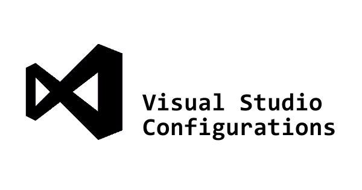

About visualstudio-configurations
---------------------------------

This is a small repo used to contain my customised Visual Studio settings files for each version of Visual Studio that I use.

I was hosting this in my personal DropBox account but as I have been [cleaning up my configuration files] (https://github.com/andy-crouch/dotfiles/) I decided this would be a good time to create this repo.

Each version of Visual Studio has it's own sub-directory and you are more than welcome to use a clone of my settings as a basis for your own configuration.  However, I change things at will to modify my own work flow and will push these changes on a frequent occurrence.

To load the my config open Visual Studio and select Tools > Options.  In the dialog select "Import and Export Settings" and use the Browse button to select the file from your cloned repo.

Any suggestions or comments are always welcome

vs2013 Configuration
--------------------------------

I have now installed Visual Studio 2013 and it seems to have picked up a lot of settings from my 2012 configuration.

So I have retained my stripped down IDE set-up which runs the [Jellybeans] (http://studiostyl.es/schemes/jellybeans) theme.  I have only installed the [VsVim] (http://visualstudiogallery.msdn.microsoft.com/59ca71b3-a4a3-46ca-8fe1-0e90e3f79329) extension and most of my keyboard shortcuts came across from my 2012 configuration.  If you import my settings it is highly recommended you go through the Keyboard short cuts to see what's changed from the standard configuration.

vs2012/vs2012-win8 Configuration
--------------------------------

I have now installed Visual Studio 2012 and it seems to have picked up a lot of settings from my 2010 configuration.

Therefore, I am still using a very stripped down IDE set-up which runs the [Jellybeans] (http://studiostyl.es/schemes/jellybeans) theme.  I have only installed the [VsVim] (http://visualstudiogallery.msdn.microsoft.com/59ca71b3-a4a3-46ca-8fe1-0e90e3f79329) extension and most of my keyboard shortcuts came across from my 2010 configuration.  If you import my settings it is highly recommended you go through the Keyboard short cuts to see what's changed from the standard configuration.

The -win8 variation is a copy of my 2012 config and tweaked for my Windows 8 machine.  Nothing particularly different apart from my font settings.

vs2010 Configuration
--------------------

I currently use a very stripped down IDE set-up which runs the [Jellybeans] (http://studiostyl.es/schemes/jellybeans) theme which I have modified to make better (imho!).  A lot of the standard keyboard short cuts have been changed as I use the excellent [VsVim] (http://visualstudiogallery.msdn.microsoft.com/59ca71b3-a4a3-46ca-8fe1-0e90e3f79329) extension to implement Vim key bindings.  If you import my settings it is highly recommended you go through the Keyboard short cuts to see what's changed from the standard configuration.

Apart from the keyboard short cuts my configuration strips Visual Studio right back to one Main tool bar and collapses all of the tool windows.

Common Keyboard Shortcuts
-------------------------

The most common short cuts I use over what is provided by [VsVim] (http://visualstudiogallery.msdn.microsoft.com/59ca71b3-a4a3-46ca-8fe1-0e90e3f79329) are :

* Ctrl+Shift+B - Build the solution.
* Ctrl+Shift+C - Clean the solution.
* Ctrl-a, Ctrl-d - Attach the debugger to a process.
* Ctrl-d, Ctrl-d - Detach the debugger from all processes.
* Ctrl-o, Ctrl-f - Open the file manager in the directory of the file being edited.
* Ctrl-k, Ctrl-c - Comment the current line.
* Ctrl-k, Ctrl-u - Uncomment the current line.
* Ctrl-k, Ctrl-o - Keep open current preview window.
* Ctrl-Shift-l   - Open Solution Explorer.
* Ctrl-Shift-e   - Open Errors window.
* Ctrl-Shift-s   - Open SQL Explorer wimdow.
* Ctrl-g, Ctrl-v - Go to associated view.
* Ctrl-a, Ctrl-v - Add  associated view.
* Ctrl-t, Ctrl-e - Open Team Explorer
* Ctrl-v, Ctrl-s - Open Source Control Explorer
